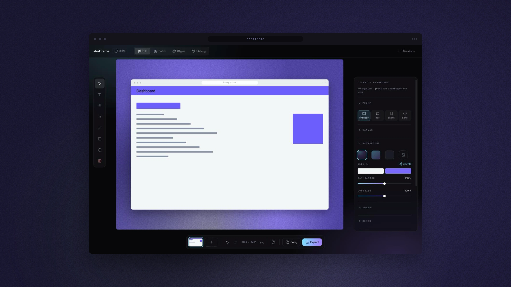
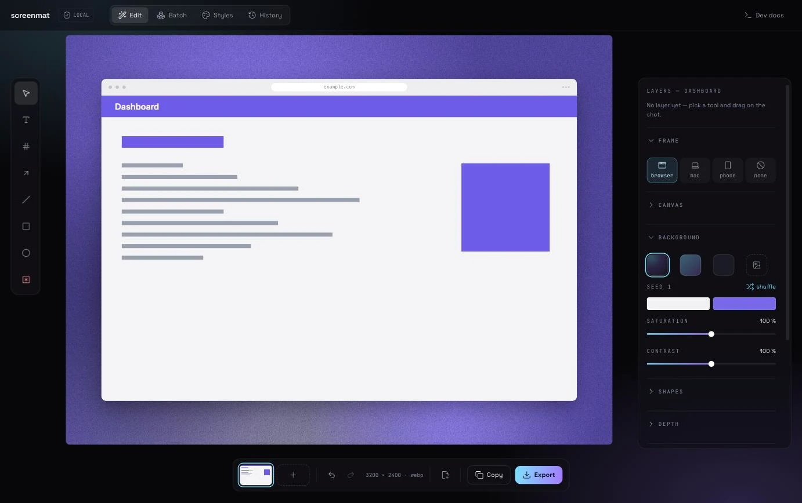
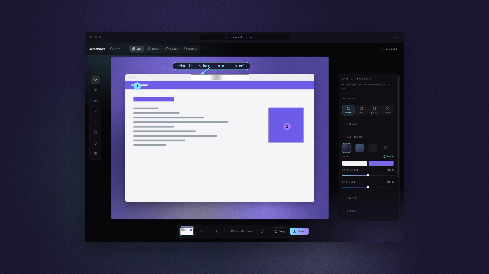

<div align="center">

# screenmat

**Un screenshot brut, un visuel qu'on a envie de partager.**
Une fenêtre arrondie façon macOS, un fond génératif dérivé des couleurs du
screenshot, des annotations, du floutage — le tout calculé dans le navigateur.

[](https://github.com/samuelboulery/screenmat/actions/workflows/ci.yml)
[](LICENSE)
[](https://react.dev)
[](https://www.typescriptlang.org)
[](#la-confidentialité-par-construction)

[English](README.md) · Français



</div>

---

## Pourquoi

- **Rien ne quitte la machine.** Aucun backend, aucun compte, aucun envoi, pas
  une requête réseau une fois la page chargée — polices comprises. Vos captures
  restent là où elles ont été prises.
- **Un seul chemin de rendu.** La preview, l'export web, le CLI et le serveur MCP
  appellent le même `renderScene()`. Un export 3× est l'homothétique exact de ce
  qu'on voyait à l'écran, par construction et non par vigilance.
- **Le floutage est cuit dans les pixels**, jamais posé en filtre CSS. Ce qui est
  masqué est réellement illisible dans le fichier exporté.
- **Sortie déterministe.** Même seed, même fond, au pixel près — une chaîne de
  documentation peut régénérer toute une série et retomber sur des octets
  identiques.
- **Deux portes.** Un humain ouvre l'app ; un script de build, un générateur de
  docs ou un agent IA passe par le CLI, le serveur MCP ou l'API Node.

## Ce qu'il sait faire

| | |
| --- | --- |
| **Fenêtres** | `browser` (chrome macOS avec barre d'adresse éditable), `macbook`, `iphone`, ou `none`. Barre de titre optionnelle, rayon des angles et inclinaison sur l'axe Y (−24° à 24°) réglables. |
| **Fonds** | `mesh`, `gradient`, `solid` ou votre propre image — tous dérivés des couleurs dominantes du screenshot, avec des molettes pour le flou, le nombre de formes, l'opacité, la saturation, le contraste et le grain. |
| **Annotations** | Sept natures de calques : étiquettes de texte, badges numérotés, flèches, traits, rectangles, ellipses et floutage. Couleur, taille, épaisseur, remplissage, opacité et contraste inversé, calque par calque. |
| **Floutage** | `blur`, `pixel` ou `solid`, cuit sous le clip de la fenêtre. |
| **Compositions** | Jusqu'à 24 shots dans un même visuel : `single`, `stack`, `side` ou `tilt3d`, avec écartement, convergence et élévation. |
| **Calques** | Un vrai arbre — groupes, réordonnancement, masquage, verrouillage, multi-sélection, annuler/rétablir. |
| **Styles** | Enregistrer un jeu de réglages complet sous un nom, le rappeler depuis l'app, le CLI, MCP ou Node. Le partager, c'est exporter un `.json`. |
| **Lot** | Une file de captures, un seul style, un `.zip` en sortie. |
| **Historique** | Les exports passés vivent dans IndexedDB avec leurs vignettes, réouvrables avec tous leurs réglages. |
| **Export** | WebP par défaut (7 à 10× plus léger que le PNG à grain égal), PNG à la demande, en 1× / 2× / 3× — 1600, 3200 ou 4800 px de large. |

### Avant · après

| Le screenshot brut | Le même, mis en scène et annoté |
| --- | --- |
|  |  |

Des badges, une flèche d'appel et un flou sur la barre d'adresse — le flou est
dans les pixels, pas posé par-dessus.

## Démarrer

```bash
pnpm install
pnpm dev
```

Puis coller une capture (`⌘V`) ou déposer un fichier. C'est toute
l'installation : rien à configurer, nulle part où se connecter.

Prérequis : **Node 24 ou plus récent** et **pnpm**. Node 24 exécute le TypeScript
de `cli/` tel quel, la porte machine n'a donc aucune étape de build.

## La porte machine

Le même moteur, appelé par autre chose qu'un humain. `render(spec)` est le cœur ;
le CLI, le serveur MCP et l'import direct n'en sont que des enveloppes.

```bash
# Ligne de commande — les défauts sont déjà bons.
pnpm cli capture.png
# → capture-screenmat.webp  3200×2400  188464 octets

# Un dossier entier, un style, une destination.
pnpm cli shots/*.png --style docs --out-dir ./build

# Une scène complète : annotations, floutage, composition.
pnpm cli --spec scene.json --scale 3 -o hero@3x.webp
```

```ts
// Script Node — l'import direct.
import { render } from 'screenmat/node'
import { writeFile } from 'node:fs/promises'

const { buffer, width, height } = await render({
  input: 'capture.png',
  settings: { frame: 'macbook', ratio: '16:9' },
  scale: 2,
})

await writeFile('docs/hero.webp', buffer)
```

```bash
# Agent IA — le serveur MCP se déclare une fois.
claude mcp add screenmat -- node /chemin/absolu/vers/screenmat/cli/mcp.ts
```

Trois outils MCP : `screenmat_render` (écrit un fichier et renvoie son chemin —
jamais les octets de l'image), `screenmat_inspect` (le repère des calques, à
appeler avant d'en placer un) et `screenmat_list_styles`. Rien n'est jamais
écrasé, et tout chemin écrit reste sous la racine de sortie configurée.

**La documentation complète vit dans [`public/docs/`](public/docs/)** — une seule
source, servie de deux façons : la page `/docs` de l'app la met en forme, et les
`.md` se lisent tels quels, sur GitHub, par `curl`, ou donnés à un modèle. Elle
est rédigée en anglais.

| Page | Ce qu'on y trouve |
| --- | --- |
| [overview.md](public/docs/overview.md) | Le tour d'horizon, les prérequis, le démarrage en 60 s |
| [cli.md](public/docs/cli.md) | Tous les flags, avec défaut et bornes |
| [mcp.md](public/docs/mcp.md) | Le branchement, la garde d'écriture, les trois outils |
| [api.md](public/docs/api.md) | `render()` et `inspect()`, types de retour, erreurs |
| [scene.md](public/docs/scene.md) | Le JSON de scène, champ par champ |
| [coordinates.md](public/docs/coordinates.md) | Le repère des calques — à lire avant d'en poser un |
| [styles.md](public/docs/styles.md) | Régler une fois dans l'app, rappeler par son nom |
| [recipes.md](public/docs/recipes.md) | Recettes exécutables, puis dépannage |
| [llms.txt](public/docs/llms.txt) | L'index à donner à un modèle |

## Raccourcis clavier

Les combinaisons à modificateur valent partout dans l'app ; les touches nues
n'agissent que lorsque le canvas a le focus, ainsi aucun raccourci à touche
unique ne vole une frappe à un panneau.

| | |
| --- | --- |
| `⌘E` / `⌘C` | Exporter · copier dans le presse-papiers |
| `⌘Z` / `⇧⌘Z` | Annuler · rétablir |
| `⌘D` · `⌘A` | Dupliquer · tout sélectionner |
| `⌘G` / `⇧⌘G` | Grouper · dégrouper |
| `⌘↑` / `⌘↓` | Monter ou descendre le calque dans la pile |
| `⌘V` | Coller une capture |
| `R` | Mélanger — nouveau seed, nouveau fond |
| `1` `2` `3` | Échelle d'export |
| Flèches (`⇧` pour un grand pas) | Déplacer la sélection |
| `⌫` · `Échap` | Supprimer · désélectionner |

## La confidentialité par construction

L'app ne fait aucune requête réseau après le chargement, n'a ni analytics, ni
télémétrie, ni dépendance runtime au-delà de React et des icônes Lucide. Les
préférences vivent dans `localStorage`, les styles et l'historique dans
IndexedDB, les polices sont embarquées. Partager un style, c'est exporter un
`.json` — il n'y a aucun serveur par lequel le faire passer.

## Organisation du dépôt

```
src/lib/          le moteur : logique pure et Canvas 2D, sans import React
src/components/   l'interface, un composant PascalCase par fichier
src/hooks/        les hooks use*
cli/              la porte machine : api.ts, main.ts (CLI), mcp.ts (serveur MCP)
public/docs/      la source de la documentation, en Markdown
```

`src/lib/render.ts` porte l'unique moteur de rendu, `src/lib/tree.ts` l'unique
chemin de manipulation de l'arbre de calques, et `src/lib/spec.ts` valide toute
donnée externe — un style importé ou une scène écrite par un modèle est une
entrée non fiable, vérifiée champ par champ et ramenée dans ses bornes.

## Développement

```bash
pnpm dev          # serveur de dev
pnpm build        # tsc -b && vite build
pnpm typecheck    # tsc -b, sur l'app, node et cli
pnpm test         # Vitest — logique pure et rendu headless du CLI
```

Deux dépendances runtime seulement : React et `lucide-react`. La couleur, le
canvas, l'écriture de zip et les composants d'interface sont écrits à la main,
volontairement.

## Contribuer

Issues et pull requests bienvenues. Ouvrir une issue avant un gros changement,
garder `pnpm typecheck` et `pnpm test` au vert, et rédiger les commits en
[Conventional Commits](https://www.conventionalcommits.org). Le code et les
identifiants sont en anglais, les commentaires en français.

## Licence

[MIT](LICENSE) © Samuel Boulery
