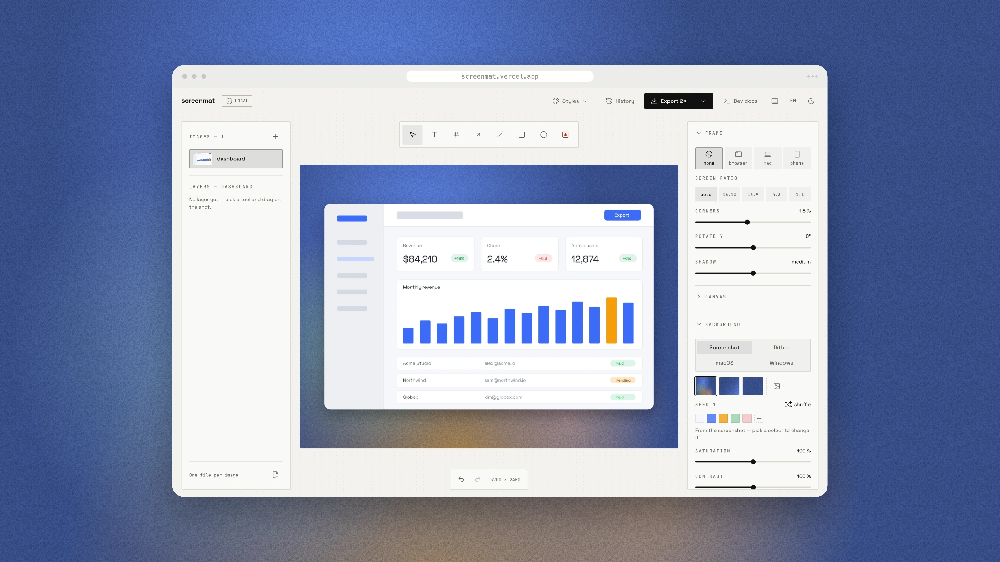
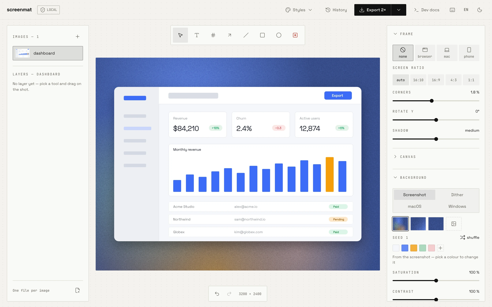
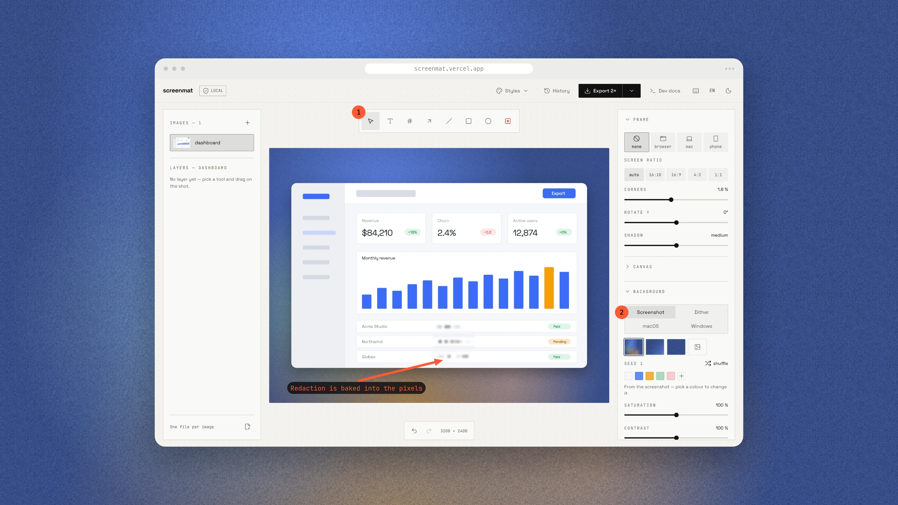

<div align="center">

# screenmat

**Turn a raw screenshot into a visual worth sharing.**
A rounded macOS-style window, a background generated from the screenshot's own
colours, annotations, redaction — rendered entirely in your browser.

[](https://github.com/samuelboulery/screenmat/actions/workflows/ci.yml)
[](LICENSE)
[](https://react.dev)
[](https://www.typescriptlang.org)
[](#privacy-by-construction)

English · [Français](README.fr.md)



</div>

---

## Why

- **Nothing leaves the machine.** No backend, no account, no upload — fonts
  included. Your screenshots stay where they were taken. The page loads a
  cookieless visit counter, and nothing else touches the network.
- **One rendering path.** The live preview, the web export, the CLI and the MCP
  server all call the same `renderScene()`. A 3× export is the exact homothety of
  what you saw, by construction rather than by vigilance.
- **Redaction is baked into the pixels**, never applied as a CSS filter. What is
  masked is genuinely unreadable in the exported file.
- **Deterministic output.** Same seed, same background, pixel for pixel — so a
  docs pipeline can regenerate a whole set and get byte-identical results.
- **Two doors.** A human opens the app; a build script, a docs generator or an AI
  agent goes through the CLI, the MCP server or the Node API.

## What it does

| | |
| --- | --- |
| **Frames** | `browser` (macOS chrome with an editable address bar), `macbook`, `iphone`, or `none`. Title bar optional, corner radius and Y-axis tilt (−24° to 24°) adjustable. |
| **Backgrounds** | Four series — generated from the screenshot (`mesh`, `gradient`, `solid`), the real macOS wallpapers from Big Sur to Golden Gate (`tahoe-dark`, `sonoma-light`, …), the Windows ones from XP to 11 (`windows-11-dark`, `windows-xp`, …) and dithered (`bayer`, `halftone`, `atkinson`, `contours`, `truchet`, … eleven patterns) — or your own image. Every generated colour is editable; dials for blur, shapes, opacity, saturation, contrast, grain, dither cell and angle. |
| **Annotations** | Seven layer kinds: text labels, ranked badges, arrows, lines, boxes, ellipses and redaction. Colour, size, stroke, fill, opacity and inverted contrast per layer. |
| **Redaction** | `blur`, `pixel` or `solid`, as a rectangle or an ellipse, baked under the window clip. |
| **Compositions** | Up to 24 shots in one visual: `single`, `stack`, `side` or `tilt3d`, with spread, convergence and elevation. |
| **Layers** | A real tree — groups, reordering, hide, lock, multi-selection, undo/redo. |
| **Styles** | Save a full set of settings under a name, recall it from the app, the CLI, MCP or Node. Share it as a `.json` file. |
| **Batch** | Drop or pick several screenshots at once, keep them as separate images, export them all as one `.zip` — from the Export menu. |
| **History** | Past exports live in IndexedDB with their thumbnails, reopenable with every setting intact. |
| **Languages** | The interface in English and French — an `EN` / `FR` switch in the top bar, the browser's language until you choose. The landing page lives at `/` and `/fr/`. The machine door and its docs stay in English. |
| **Export** | WebP by default (7–10× lighter than PNG at equal grain), PNG on demand, at 1× / 2× / 3× — 1600, 3200 or 4800 px wide. |

### Before · after

| The raw screenshot | The same one, framed and annotated |
| --- | --- |
|  |  |

Badges, a callout arrow and a blur over the customer emails — the blur is in the
pixels, not on top of them.

## Quickstart

```bash
pnpm install
pnpm dev
```

Then paste a screenshot (`⌘V`) or drop a file. That is the whole setup — there is
nothing to configure and nowhere to sign in.

Requirements: **Node 24 or newer** and **pnpm**. Node 24 runs the TypeScript in
`cli/` directly, so the machine door has no build step.

## The machine door

The same engine, called by something other than a human. `render(spec)` is the
core; the CLI, the MCP server and a direct import are thin wrappers around it.

```bash
# From any project — no clone needed.
pnpm dlx screenmat screenshot.png --frame macbook
pnpm add -D screenmat            # for a build script: import { render } from 'screenmat/node'
```

The npm package ships everything but the macOS and Windows wallpapers, which
are © Apple and © Microsoft: use those from a clone of this repository.

```bash
# Command line — the defaults are already good.
pnpm cli screenshot.png
# → screenshot-screenmat.webp  3200×2400  188464 bytes

# A whole folder, one style, one destination.
pnpm cli shots/*.png --style docs --out-dir ./build

# A full scene: annotations, redaction, composition.
pnpm cli --spec scene.json --scale 3 -o hero@3x.webp

# A URL, captured in a local headless Chrome, then framed.
pnpm cli http://localhost:5173 --frame browser --full-page
```

```ts
// Node script — the direct import.
import { render } from 'screenmat/node'
import { writeFile } from 'node:fs/promises'

const { buffer, width, height } = await render({
  input: 'screenshot.png',
  settings: { frame: 'macbook', ratio: '16:9' },
  scale: 2,
})

await writeFile('docs/hero.webp', buffer)
```

```bash
# AI agent — register the MCP server once.
claude mcp add screenmat -- pnpm dlx -p screenmat screenmat-mcp
# From a clone: claude mcp add screenmat -- node /absolute/path/to/screenmat/cli/mcp.ts
```

Four MCP tools: `screenmat_render` (writes a file, returns its path — never the
image bytes), `screenmat_inspect` (the layer coordinate frame, to call before
placing an annotation), `screenmat_capture` (a URL, captured to a PNG) and
`screenmat_list_styles`. Nothing is ever overwritten,
and every written path is confined to the configured output root.

**Full documentation lives in [`public/docs/`](public/docs/)** — one source,
served two ways: the `/docs` page of the app renders it, and the raw `.md` files
read fine on GitHub, through `curl`, or handed to a model.

| Page | What is in it |
| --- | --- |
| [overview.md](public/docs/overview.md) | The tour, the requirements, a 60-second start |
| [cli.md](public/docs/cli.md) | Every flag, with its default and its bounds |
| [mcp.md](public/docs/mcp.md) | Wiring, the write guard, the three tools |
| [api.md](public/docs/api.md) | `render()` and `inspect()`, return types, errors |
| [scene.md](public/docs/scene.md) | The scene JSON, field by field |
| [coordinates.md](public/docs/coordinates.md) | The layer coordinate frame — read before placing one |
| [styles.md](public/docs/styles.md) | Set it once in the app, recall it by name |
| [recipes.md](public/docs/recipes.md) | Runnable examples, then troubleshooting |
| [llms.txt](public/docs/llms.txt) | The index to hand to a model |

## Keyboard shortcuts

Modifier combinations work anywhere in the app; bare keys apply when the canvas
has focus, so no single-key shortcut ever steals a keystroke from a panel.

| | |
| --- | --- |
| `⌘E` / `⌘C` | Export · copy to clipboard |
| `⌘Z` / `⇧⌘Z` | Undo · redo |
| `⌘D` · `⌘A` | Duplicate · select every layer |
| `⌘G` / `⇧⌘G` | Group · ungroup |
| `⌘↑` / `⌘↓` | Move the layer up or down the stack |
| `⌘V` | Paste a screenshot |
| `V` `T` `N` `A` `L` `R` `O` `B` | Tools: select, text, badge, arrow, line, box, ellipse, redact |
| `⇧R` | Shuffle — a new seed, a new background |
| `1` `2` `3` | Export scale |
| Arrows (`⇧` for a large step) | Nudge the selection |
| `⌫` · `Esc` | Delete · deselect |
| `⌥` drag | Duplicate a layer · move a whole image |
| `Space` drag | Reposition a cropped screenshot inside its frame |
| `?` | Every shortcut, in one panel |

## Privacy by construction

Your images are never uploaded: every pixel is processed in the browser.
Preferences live in `localStorage`, styles and history in IndexedDB, fonts are
bundled. Sharing a style means exporting a `.json` file — there is no server to
share it through.

The one exception is [Cloudflare Web
Analytics](https://developers.cloudflare.com/web-analytics/), a page counter
with no cookie, no identifier and no cross-site tracking. It counts visits and
nothing else. Block it and the app is unaffected. The CLI, the Node API and the
MCP server make no network call, except to load a URL you explicitly ask them to
capture — in a browser on your own machine.

## Project layout

```
src/lib/          the engine: pure logic and Canvas 2D, no React import
src/components/   the interface, one PascalCase component per file
src/hooks/        use* hooks
src/lib/i18n/     the interface text, one English and one French dictionary per area
src/landing/      the static landing page, translated to /fr/ at build time
cli/              the machine door: api.ts, main.ts (CLI), mcp.ts (MCP server)
public/docs/      the documentation source, in Markdown
```

`src/lib/render.ts` holds the one and only rendering engine, `src/lib/tree.ts`
the one and only path for manipulating the layer tree, and `src/lib/spec.ts`
(scenes) with `src/lib/styles.ts` (styles) validate every piece of external
data — an imported style or a scene written by a model is untrusted input, checked field by field and clamped to its bounds.

## Development

```bash
pnpm dev          # dev server
pnpm build        # tsc -b && vite build
pnpm typecheck    # tsc -b, across app, node and cli
pnpm test         # Vitest — pure logic plus headless CLI rendering
```

Only two runtime dependencies: React and `lucide-react`. Colour handling, canvas
work, zip writing and the UI components are all written by hand, on purpose.

## Contributing

Issues and pull requests are welcome. Open an issue before a large change, keep
`pnpm typecheck` and `pnpm test` green, and write commits in the
[Conventional Commits](https://www.conventionalcommits.org) style. Code and
identifiers are in English; comments in this codebase are in French.

## License

[MIT](LICENSE) © Samuel Boulery

The macOS and Windows wallpapers in `public/wallpapers/` are © Apple Inc. and
© Microsoft Corporation. They are not covered by that licence — see
[the notice](public/wallpapers/NOTICE.md).
